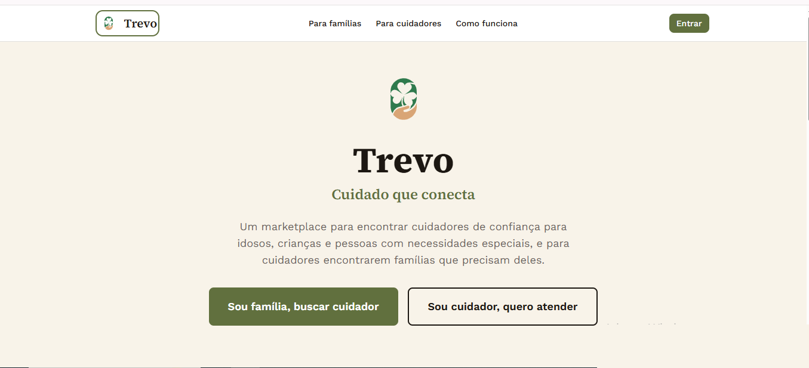
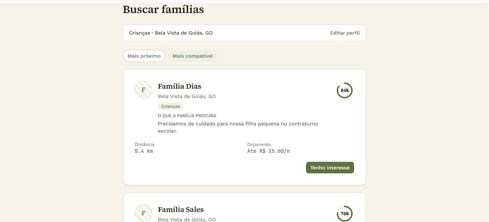
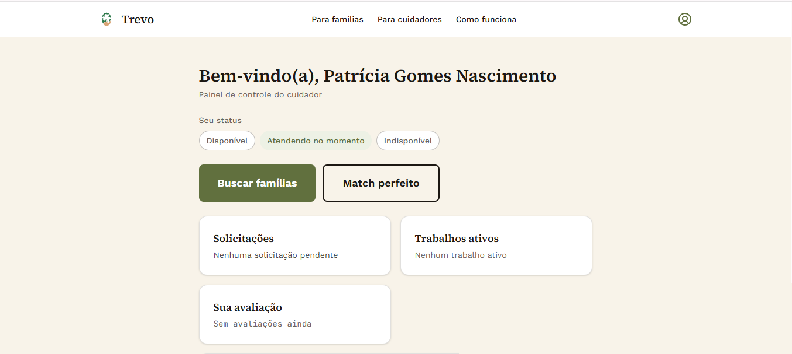

# Trevo — Cuidado que conecta

Um marketplace de dois lados para conectar famílias que precisam de
cuidadores (para idosos, crianças ou pessoas com necessidades especiais) a
cuidadores profissionais.

🔗 **[trevo em produção →](https://cuidadores-app.vercel.app)**

---

## Sobre o projeto

Este é meu Trabalho de Conclusão de Curso em Ciência da Computação pela
UNIP. Além de resolver um problema real (encontrar um cuidador de
confiança não é trivial, e a maioria das opções hoje depende de indicação
boca a boca), o projeto foi um ponto de partida para estudar a fundo dois
temas que me interessaram: teoria dos grafos aplicada a problemas
de emparelhamento, e as decisões de segurança/engenharia por trás de um
sistema com dados sensíveis de verdade.

O núcleo técnico modela o problema família↔cuidador como um **grafo
bipartido ponderado**, e usa dois algoritmos diferentes para resolvê-lo: um
ranking guloso por peso (rápido, direto) e uma implementação do
**Gale-Shapley** (variante hospital-residents) para emparelhamento
estável — o mesmo tipo de algoritmo usado em sistemas reais de alocação de
residência médica.





## Funcionalidades

- Cadastro e autenticação separados por tipo de usuário (família/cuidador)
- Busca e recomendação automática nos dois sentidos, com geolocalização
  real (geocodificação via OpenStreetMap)
- Matching por grafo bipartido ponderado (distância, tipo de cuidado,
  avaliação, preço) + emparelhamento estável via Gale-Shapley
- Fluxo completo de contratação (solicitar → aceitar/recusar → concluir),
  com contato liberado condicionalmente
- Avaliações pós-serviço
- Upload seguro de documentos de verificação (bucket privado + signed URLs)
- Controles de privacidade e disponibilidade para os dois lados

## Stack

| | |
|---|---|
| Frontend + Backend | Next.js (App Router) + TypeScript |
| Banco de dados | PostgreSQL (Supabase) |
| ORM | Prisma |
| Autenticação | NextAuth.js |
| Estilo | Tailwind CSS v4 |
| Deploy | Vercel |

## Rodando localmente

```bash
git clone https://github.com/joaovictorpt/cuidadores-app.git
cd cuidadores-app
npm install
```

Crie um `.env` a partir do `.env.example` e preencha com suas próprias
credenciais (Supabase, NextAuth, etc.):

```bash
cp .env.example .env
```

Rode as migrations e suba o servidor:

```bash
npx prisma migrate dev
npm run dev
```

O app estará em `http://localhost:3000`.

### Popular com dados de demonstração

```bash
npm run seed:demo
```

Cria 15 famílias e 15 cuidadores fictícios (mesma senha para todos:
`Demo@2026`), com variedade de cidades, preços, tipos de cuidado e
histórico de contratações — útil para testar a busca e o matching sem
precisar cadastrar tudo manualmente. Para limpar:

```bash
npm run cleanup:demo
```

## Autor

João Victor Porto Tolentino — Ciência da Computação, UNIP (previsão de
conclusão: 06/2027)

[LinkedIn](https://linkedin.com/in/joão-victor-porto-tolentino-501ba1402) ·
[GitHub](https://github.com/joaovictorpt)
